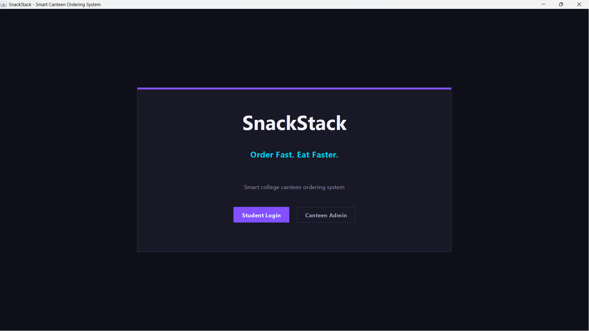
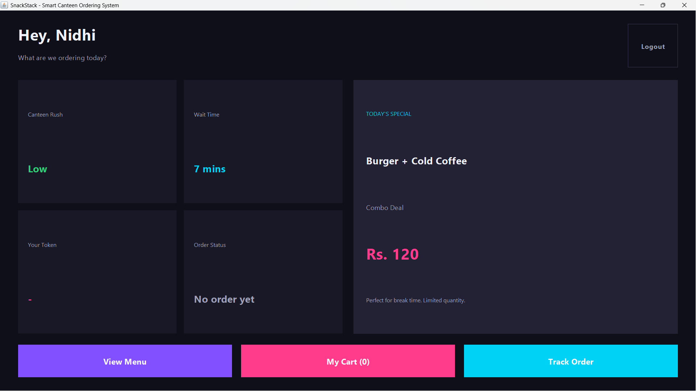
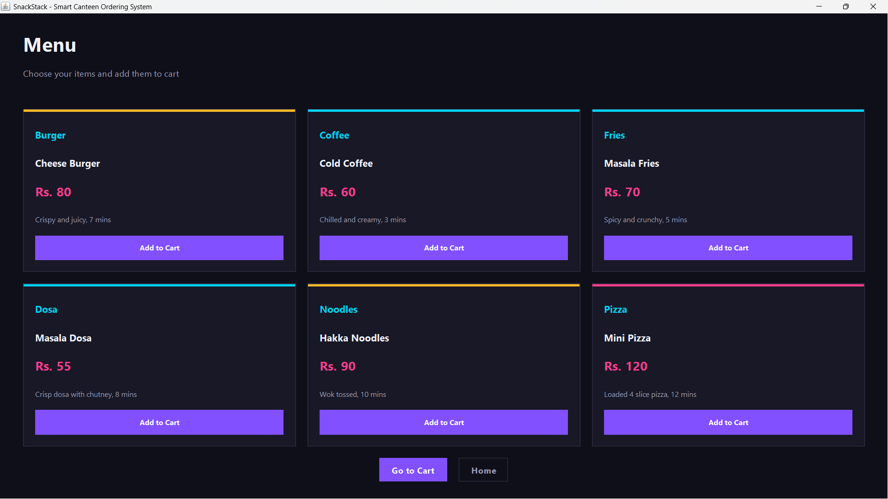
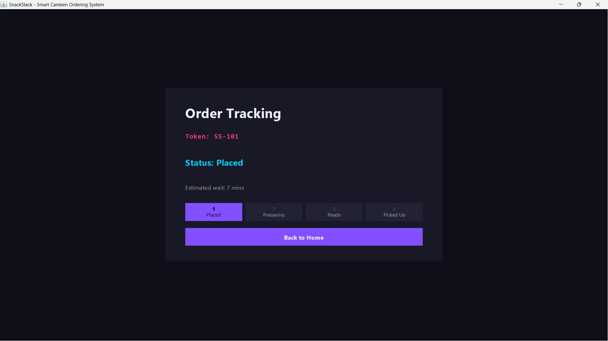
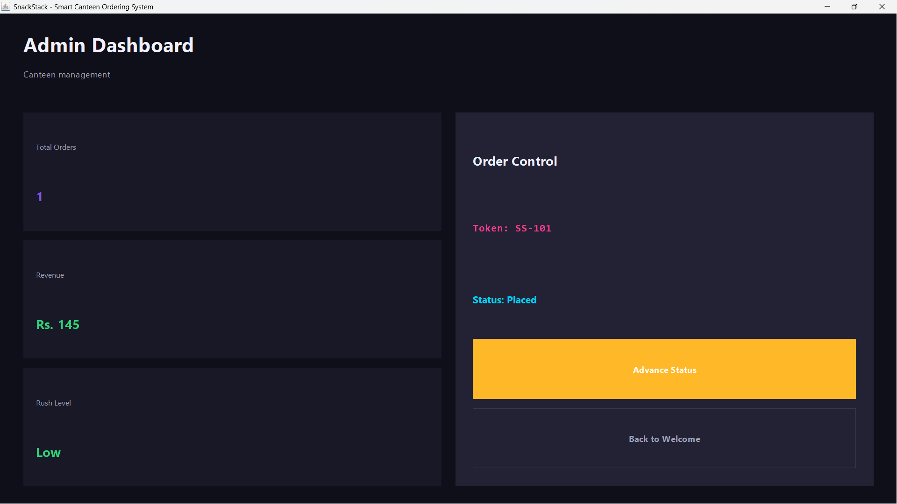

# SnackStack

A modern Java Swing based smart canteen ordering system for college campuses.

SnackStack allows students to:

* Browse menu items
* Add items to cart
* Place orders
* Track order status using tokens

The project also includes a simple admin dashboard for managing order progress.

---

## Features

* Student Login
* Food Menu
* Cart System
* Token Generation
* Order Tracking
* Admin Dashboard
* Modern Dark UI

---

## Tech Stack

* Java
* Java Swing
* AWT

---

## Screenshots

### Welcome Screen


---

### Dashboard


---

### Menu


---

### Cart


---

### Order Tracking


---

### Admin Dashboard


---

## Run the Project

```bash
javac SnackStack.java
java SnackStack
```

---

## Author

Nidhi Sahare
